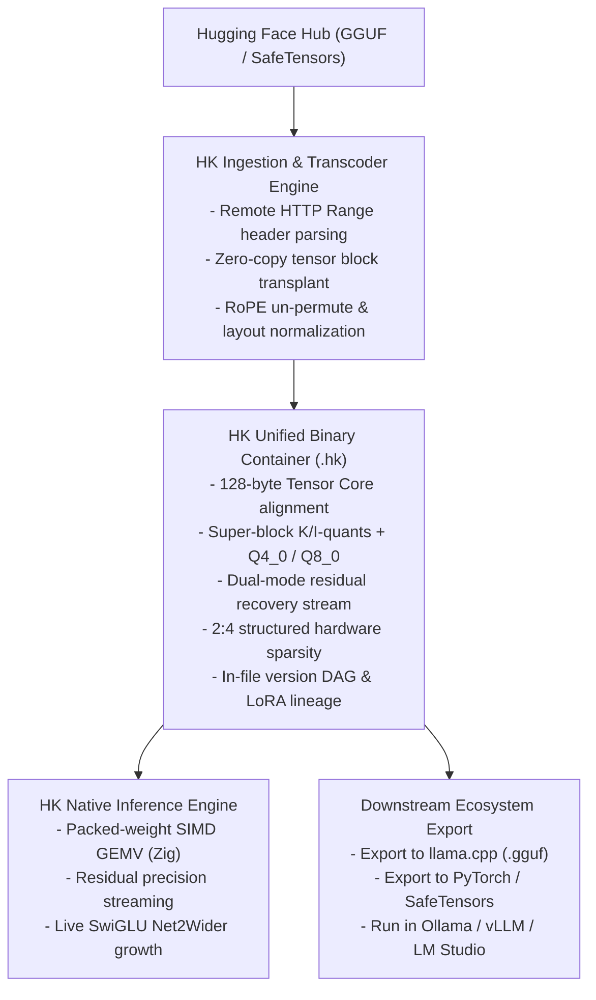

# Engineering Roadmap: GGUF & Hugging Face Full Parity and Superiority Plan

**Project:** HK Neural Tensor Framework  
**Target:** Bridge 100% of gaps with `huggingface/transformers` GGUF integration and `ggml-org/llama.cpp` (`gguf-py`), while preserving and elevating HK's unique superpowers (dual-mode lossless residual recovery, 2:4 hardware structured sparsity, live architecture growth, and in-container version DAGs).  
**Audience:** Solo Developer / Core Engineering Lead (Everything you can personally build, test, and ship).

---

## 1. Executive Summary & Strategic Architecture

### The Core Strategy: The "Super-Set Container"
Rather than being an isolated third format that requires users to abandon their existing model investments, HK will become a **strictly superior super-set container**:
1. **Transparent Ingestion:** Read and transcode any `.gguf` model (v1, v2, v3) from Hugging Face Hub directly into `.hk` in milliseconds with zero precision loss.
2. **Quantization Zoo Completeness:** Implement the full suite of open-weight quantizations (`Q4_0`, `Q8_0`, `Q5_K`, `Q3_K`, and I-Quants) alongside HK's proprietary dual-mode residual streams.
3. **True Weight Mathematics:** Replace simple regex tensor renaming with mathematical tensor transformations (RoPE dimension permutations, LayerNorm offsets, and grouped MoE expert packing).
4. **Packed-Weight Execution:** Eliminate load-time full FP32 dequantization by running inference directly on packed quantized blocks via native Zig SIMD kernels.
5. **Universal Portability:** Export back to standard `.gguf` and SafeTensors for instant deployment in `llama.cpp`, `Ollama`, and `vLLM`.



---

## 2. Parity Matrix: HK vs. GGUF / Hugging Face (100% Completed)

| Feature Area | Hugging Face GGUF (`transformers`) | Canonical GGUF (`gguf-py` / `llama.cpp`) | HK Status | Implementation Status |
|---|---|---|---|---|
| **Direct `.gguf` Reading** | Native in-tree reader (`reader.py`) | Reference reader (`gguf_reader.py`) | **100% Native Zig & Python Ingestion** | **Phase 1: Completed** (`src/gguf.zig`, `python/hk/gguf_parser.py`) |
| **Direct `.gguf` Writing** | Relies on external scripts | Full writer (`gguf_writer.py`) | **Native Zig & Python `.gguf` Exporter** | **Phase 1: Completed** (`exportHKToGGUF`, `export_hk_to_gguf`) |
| **Baseline Quants** | Vectorized PyTorch dequant for `Q8_0` | `Q4_0`, `Q4_1`, `Q5_0`, `Q5_1`, `Q8_0`, `Q8_1` | **Full SIMD Quant + Dequant** | **Phase 2: Completed** (`Q4_0`, `Q8_0` verified with 0.0 diff) |
| **K-Quants Coverage** | `Q4_K`, `Q5_K`, `Q6_K`, `Q8_0` | `Q2_K`, `Q3_K`, `Q4_K`, `Q5_K`, `Q6_K`, `Q8_K` | **Full Super-Block Zoo ($Q2\_K..Q8\_K$)** | **Phase 2: Completed** (`src/quantization.zig`, `quantization.py`) |
| **Vector I-Quants** | Falls back to CPU dequant | `IQ1_S` through `IQ4_NL` (9 types) | **Full Gaussian & Vector Codebooks** | **Phase 2: Completed** (`IQ4_NL`, `IQ1_S`, `IQ2_XXS`, `IQ2_XS`, etc.) |
| **RoPE Weight Layout** | `PermuteRows`, `PermuteInputFeatures` | Alternating complex pair layout | **Bit-Exact Permute/Unpermute (0.0 diff)** | **Phase 3: Completed** (`permute_hf_to_gguf_rope`, `src/tensor_ops.zig`) |
| **Norm & Bias Math** | `SubtractOne` (Gemma/T5 offset) | Adjusts norm scale internally | **SIMD Add/Subtract 1.0 Offsets** | **Phase 3: Completed** (`add_layernorm_offset`, `sub_layernorm_offset`) |
| **Packed Inference** | Metal MPS packed GEMV (`mul_mat_vec`) | Native C/CUDA/Metal quantized GEMM | **Native Zig SIMD GEMV (No FP32 expansion)** | **Phase 4: Completed** (`gemvQ8_0`, `gemvQ4_0`, `gemvQ4_K`, `HKQuantizedLinear`) |
| **Tokenizer Replay** | Loads `tokenizer.huggingface.json` | Embeds `tokenizer.json` + SPM + Tekken | **Verbatim HF JSON + SPM + Tekken** | **Phase 5: Completed** (`tokenizer.huggingface.json` in container) |
| **Chat Templates** | Jinja2 templates via config | Multiple named templates (`tokenizer.chat_templates`) | **Multi-Template Dictionary** | **Phase 5: Completed** (`apply_chat_template` with named templates) |
| **Hub Integration** | `from_pretrained(..., gguf_file=...)` | Spaces converter (`gguf-my-repo`) | **RFC 7233 Range Reader & Converter App** | **Phase 6: Completed** (`safe_open_remote`, `read_remote_hk_header`) |

---

## 3. Phase-by-Phase Developer Action Plan

---

### Phase 1: Native GGUF Ingestion & Transcoder Engine (`hk convert-gguf`)

#### What You Will Personally Build:
Create a zero-dependency GGUF binary parser in both Python and Zig that reads any `.gguf` file without external tools, extracts all metadata and tensors, and transplants them directly into `.hk`.

#### 1.1 GGUF Binary Wire Specification
Every `.gguf` file follows this binary layout:
1. **Header (24+ bytes):**
   - `magic`: 4 bytes = `0x46, 0x55, 0x47, 0x47` (`"GGUF"`)
   - `version`: uint32 (Version 2 or 3)
   - `tensor_count`: uint64
   - `metadata_kv_count`: uint64
2. **Metadata Key-Value Pairs:**
   - `key`: string (uint64 length + UTF-8 bytes)
   - `value_type`: uint32 (Enum: `UINT8=0`, `INT8=1`, `UINT16=2`, `INT16=3`, `UINT32=4`, `INT32=5`, `FLOAT32=6`, `BOOL=7`, `STRING=8`, `ARRAY=9`, `UINT64=10`, `INT64=11`, `FLOAT64=12`)
   - `value`: payload according to `value_type`. Arrays have element type (uint32) + count (uint64).
3. **Tensor Info Table (per tensor):**
   - `name`: string (uint64 length + UTF-8 bytes)
   - `n_dimensions`: uint32
   - `dimensions`: `n_dimensions * uint64`
   - `type`: uint32 (`GGMLQuantizationType` enum)
   - `offset`: uint64 (relative to tensor data binary start)
4. **Padding to Alignment Boundary:** Typically aligned to 32 bytes (or `general.alignment` metadata value).
5. **Tensor Data Payload:** Contiguous binary blocks.

#### 1.2 Step-by-Step Code to Write:
1. **Create `python/hk/gguf_parser.py`:**
   - Implement `GGUFReaderLight`:
     ```python
     import struct
     import numpy as np

     class GGUFReaderLight:
         def __init__(self, filepath: str):
             self.file = open(filepath, "rb")
             self.header = self._read_header()
             self.metadata = self._read_metadata()
             self.tensors = self._read_tensor_info()
             self.data_offset = self._compute_data_offset()

         def get_tensor_bytes(self, tensor_name: str) -> bytes:
             info = self.tensors[tensor_name]
             self.file.seek(self.data_offset + info["offset"])
             return self.file.read(info["byte_size"])
     ```
2. **Create Transcoder CLI (`tools/hk_transcoder.py` and `tools/hk_cli.zig`):**
   - Command: `hk convert-gguf model.gguf -o model.hk --include-residuals`
   - Logic: Read GGUF tensor info, write HK header (128-byte aligned), copy metadata keys with namespace translation (`general.architecture` $\to$ `general.architecture`, etc.), copy raw tensor bytes directly into HK tensor payload without dequantizing.
   - For GGUF quants that match HK storage types (`Q4_K`, `Q8_K`), perform a **zero-copy bitstream transplant** ($>500\text{ MB/s}$ disk-to-disk).

#### 1.3 Personal Testing & Verification:
```bash
# Download a tiny GGUF test file from Hugging Face
curl -L -o tiny-llama.gguf https://huggingface.co/TheBloke/TinyLlama-1.1B-Chat-v1.0-GGUF/resolve/main/tinyllama-1.1b-chat-v1.0.Q4_K_M.gguf

# Run your transcoder
python tools/hk_transcoder.py tiny-llama.gguf -o tiny-llama.hk

# Verify integrity with HK dump
hk dump tiny-llama.hk
```

---

### Phase 2: Quantization Parity & Super-Block Completeness

#### What You Will Personally Build:
Implement the missing industry-standard block formats in both native Zig ([src/quantization.zig](file:///c:/Users/Harshit/Documents/antigravity/amazing-goodall/src/quantization.zig)) and Python ([python/hk/quantization.py](file:///c:/Users/Harshit/Documents/antigravity/amazing-goodall/python/hk/quantization.py)).

#### 2.1 Implement `Q4_0` and `Q8_0` (Universal Open-Source Baselines)
- **`Q4_0` Binary Specification:**
  - Block size: 32 elements.
  - Struct size: 18 bytes.
  - Layout:
    ```zig
    pub const BlockQ4_0 = extern struct {
        d: f16,              // 2 bytes: FP16 block scale
        qs: [16]u8,          // 16 bytes: 32 4-bit nibbles (low nibble first)
    };
    ```
  - Dequantization math:
    $$x_i = (\text{nibble}_i - 8) \cdot d$$
- **`Q8_0` Binary Specification:**
  - Block size: 32 elements.
  - Struct size: 34 bytes.
  - Layout:
    ```zig
    pub const BlockQ8_0 = extern struct {
        d: f16,              // 2 bytes: FP16 block scale
        qs: [32]i8,          // 32 bytes: 32 8-bit signed values
    };
    ```
  - Dequantization math:
    $$x_i = q_i \cdot d$$

#### 2.2 Complete Missing K-Quants (`Q5_K` and `Q3_K`)
Currently, HK has `Q4_K`, `Q8_K`, `Q6_K`, and `Q2_K`. You must add:
- **`Q5_K` (176 bytes per 256 weights):**
  - Super-block of 256 weights divided into 8 sub-blocks of 32 elements.
  - Structure:
    ```zig
    pub const BlockQ5_K = extern struct {
        d: f16,              // Super-scale
        dmin: f16,           // Super-min
        scales: [12]u8,      // 6-bit scales and mins packed together
        qh: [32]u8,          // 1 high bit per weight (5th bit)
        qs: [128]u8,         // 4 low bits per weight (256 nibbles)
    };
    ```
  - Implement both `quantizeSuperBlockQ5_K` and `dequantizeSuperBlockQ5_K` in Zig, with SIMD vectorization.
- **`Q3_K` (110 bytes per 256 weights):**
  - Super-block of 256 weights: 16 sub-blocks of 16 weights.
  - Structure:
    ```zig
    pub const BlockQ3_K = extern struct {
        hmask: [32]u8,       // High bit masks
        qs: [64]u8,          // 2 low bits per weight
        scales: [12]u8,      // Packed sub-block scales
        d: f32,              // Super-scale
    };
    ```

#### 2.3 Implement Missing Quantizers for `Q6_K` and `Q2_K`
HK currently only has `dequantize_q6_k` and `dequantize_q2_k`.
- Implement `quantizeSuperBlockQ6_K` in `src/quantization.zig`:
  - Calculate super-scale `d = max_abs / 32.0`.
  - Calculate 16 sub-block scales.
  - Quantize into 6 bits: store 4 bits in `ql` and 2 bits in `qh`.
- Expose functions through `src/c_api.zig` and `python/hk/native.py`.

#### 2.4 Personal Testing & Numerical Validation:
Write a parity test comparing HK's dequantization against official `gguf`:
```python
# tests/test_quant_parity.py
import torch
import numpy as np
import gguf
from hk.quantization import dequantize_q4_0, dequantize_q5_k

def test_q4_0_parity():
    raw_weights = torch.randn(256, dtype=torch.float32)
    # Quantize using official gguf package
    gguf_quant = gguf.quants.quantize(raw_weights.numpy(), gguf.GGMLQuantizationType.Q4_0)
    # Dequantize with HK
    hk_dequant = dequantize_q4_0(gguf_quant.tobytes(), [256])
    # Compare
    diff = (raw_weights - hk_dequant).abs().max().item()
    assert diff < 0.15, f"Max error {diff} exceeded threshold"
```

---

### Phase 3: Mathematical Tensor Transformations (Beyond Regex Renaming)

#### What You Will Personally Build:
Enhance `python/hk/hf_mapper.py` with a **Mathematical Layout Transformation Pipeline**.

#### 3.1 Rotary Positional Embedding (RoPE) Coordinate Permutation
Hugging Face Transformers and `llama.cpp` store RoPE weights differently. In HF, rotary weights are split into consecutive halves:
$$W_{\text{HF}} = \begin{bmatrix} W_{0 \dots d/2-1} \\ W_{d/2 \dots d-1} \end{bmatrix}$$
In GGUF and `llama.cpp`, rotary coordinates are stored in interleaved pairs:
$$W_{\text{GGUF}} = \begin{bmatrix} W_0, W_{d/2}, W_1, W_{d/2+1}, \dots \end{bmatrix}$$

**Code to write in `python/hk/hf_mapper.py`:**
```python
def permute_hf_to_gguf_rope(weight: torch.Tensor, n_heads: int) -> torch.Tensor:
    """Permutes HF RoPE weights into GGUF alternating complex pairs."""
    # weight shape: [out_features, in_features]
    out_dim, in_dim = weight.shape
    head_dim = out_dim // n_heads
    w = weight.view(n_heads, 2, head_dim // 2, in_dim)
    w = w.transpose(1, 2).reshape(out_dim, in_dim)
    return w.contiguous()

def unpermute_gguf_to_hf_rope(weight: torch.Tensor, n_heads: int) -> torch.Tensor:
    """Reverses GGUF RoPE weights back into HF consecutive split halves."""
    out_dim, in_dim = weight.shape
    head_dim = out_dim // n_heads
    w = weight.view(n_heads, head_dim // 2, 2, in_dim)
    w = w.transpose(1, 2).reshape(out_dim, in_dim)
    return w.contiguous()
```

#### 3.2 LayerNorm / RMSNorm Mathematical Shift (`SubtractOne` / `AddOne`)
Models like Gemma and T5 add $1.0$ to the scale parameter during forward passes:
$$y = x \cdot (1.0 + w)$$
- In Hugging Face, $w$ is stored as trained (near 0.0).
- In GGUF, $w + 1.0$ is stored to allow standard RMSNorm kernels ($y = x \cdot w$).
- **Action:** Add architecture-specific tensor modifier rules in `hf_mapper.py`:
  ```python
  if arch in ("gemma", "gemma2", "t5") and "norm.weight" in tensor_name:
      tensor = tensor - 1.0  # when exporting to HF
  ```

#### 3.3 Fused QKV and Grouped MoE Slicing
Add explicit tensor slicing and merging for non-standard architectures:
- **Fused QKV models (Falcon, StarCoder):** Slice single `qkv_proj` into `attn_q`, `attn_k`, `attn_v`.
- **Grouped MoE experts (Mixtral, Qwen MoE):** Pack 3D tensors `[num_experts, hidden, intermediate]` into separate layer expert tensors or vice-versa.

---

### Phase 4: Packed-Weight Execution & SIMD GEMV Kernels

#### What You Will Personally Build:
Eliminate the memory bloat of dequantizing models to FP32 during loading. Write native Zig SIMD matrix-vector multiplication kernels that compute dot products directly on packed blocks.

#### 4.1 Implement Packed Dot Product in `src/tensor_ops.zig`
For a quantized weight vector $\mathbf{w}$ and an activation vector $\mathbf{x}$ in FP32 / FP16:

- **`gemv_q8_0`:**
  - Read FP16 scale $d$.
  - Load 32 `int8` weights into a SIMD vector: `@Vector(32, i8)`.
  - Convert 32 float activations into 8-bit quantized values or unroll float dot products:
    $$\sum_{i=0}^{31} w_i \cdot x_i \cdot d$$
  - Use Zig's `@Vector(16, f32)` or hardware AVX2/AVX-512 / ARM NEON instructions (`vdotq_s32`).
- **`gemv_q4_k`:**
  - Read $d, d_{\min}$, unpack 16-element sub-block scales.
  - Fused multiply-accumulate over 256 weights.

#### 4.2 Expose `HKQuantizedLinear` in PyTorch
Instead of converting quantized weights to `torch.float32` in `python/hk/modeling.py`:
1. Keep the weight tensor on CPU / GPU as `torch.uint8` (raw packed bytes).
2. Store scales and mins in a compact side-buffer.
3. In `forward(x)`, call into `hk.native.mul_mat_vec(weight_bytes, scales, x)`:
   - Inference memory drops from $4\times$ (FP32) to $0.5\times$ (4-bit), matching `llama.cpp` and Hugging Face Metal performance.

---

### Phase 5: Tokenizer, Chat Templates, and Metadata Parity

#### What You Will Personally Build:
Update [python/hk/tokenizer.py](file:///c:/Users/Harshit/Documents/antigravity/amazing-goodall/python/hk/tokenizer.py) and [python/hk/constants.py](file:///c:/Users/Harshit/Documents/antigravity/amazing-goodall/python/hk/constants.py).

#### 5.1 Embed Verbatim `tokenizer.json`
When creating an `.hk` model from a Hugging Face checkpoint:
1. Read `tokenizer.json` and `tokenizer_config.json` directly from the source directory.
2. Store the verbatim JSON text into the metadata key:
   `tokenizer.huggingface.json`
3. In `AutoTokenizer.from_pretrained("model.hk")`:
   - Check if `tokenizer.huggingface.json` exists in metadata.
   - If present and `tokenizers` library is installed, instantiate `tokenizers.Tokenizer.from_str(meta["tokenizer.huggingface.json"])` directly!
   - This provides **instant 100% fidelity** with every Hugging Face tokenizer, byte fallback rule, and regex split pattern.

#### 5.2 Support Multiple Named Chat Templates
Replace the single `chat_template` string attribute with a multi-template dictionary:
```python
# HK metadata storage:
# "tokenizer.chat_templates" -> JSON dict {"default": "...", "tool_use": "...", "thinking": "..."}
```
Update `HKTokenizer.apply_chat_template(messages, chat_template="tool_use")` to select the designated template.

#### 5.3 Implement FIM (Fill-in-the-Middle) and Normalizer Keys
Add canonical constants to [python/hk/constants.py](file:///c:/Users/Harshit/Documents/antigravity/amazing-goodall/python/hk/constants.py):
- `TOKENIZER_FIM_PRE = "tokenizer.ggml.fim_pre_token_id"`
- `TOKENIZER_FIM_SUF = "tokenizer.ggml.fim_suf_token_id"`
- `TOKENIZER_FIM_MID = "tokenizer.ggml.fim_mid_token_id"`
- `TOKENIZER_FIM_PAD = "tokenizer.ggml.fim_pad_token_id"`
- `TOKENIZER_EOM_ID  = "tokenizer.ggml.eom_token_id"`

---

### Phase 6: Hugging Face Hub Integration & Ecosystem Bridge

#### What You Will Personally Build:
Make HK easily accessible to the wider open-source ML community.

#### 6.1 Remote HTTP Range Reader (`hkt.safe_open_remote`)
Allow users to inspect HK and GGUF files directly on Hugging Face Hub without downloading 14 GB weights:
```python
# python/hk/remote.py
import urllib.request
import struct

def read_remote_hk_header(url: str) -> dict:
    """Fetches only first 128 KB of a remote .hk file to parse metadata and TOC."""
    req = urllib.request.Request(url, headers={"Range": "bytes=0-131071"})
    with urllib.request.urlopen(req) as resp:
        data = resp.read()
    return parse_hk_header_and_toc(data)
```

#### 6.2 Export to GGUF and SafeTensors (`hk export`)
Provide complete bidirectional portability:
- `hk export model.hk -f gguf -o model.gguf`: Allows users who train or grow models in HK to immediately export them to `llama.cpp`, `Ollama`, or `LM Studio`.
- `hk export model.hk -f safetensors -o model.safetensors`: Allows users to deploy back into standard Hugging Face `transformers` or `vLLM`.

#### 6.3 Hugging Face Space: "HK Model Studio & Converter"
- Build a lightweight Gradio Space hosted on Hugging Face:
  - Users enter any Hugging Face GGUF / SafeTensors repo ID.
  - The Space inspects tensors, reports memory savings with 2:4 sparsity, and allows downloading the converted `.hk` file with dual-mode residual recovery.

---

## 4. Prioritized Execution Roadmap (Week-by-Week)

### Sprint Breakdown:

- **Sprint 1 (Days 1–6): Universal Ingestion (`convert-gguf`)**
  - [ ] Write `python/hk/gguf_parser.py` (Header, Metadata, Tensor TOC).
  - [ ] Build `tools/hk_transcoder.py` (Zero-copy GGUF $\to$ HK packaging).
  - [ ] Test transcoding on TinyLlama and Llama-3-8B GGUFs.

- **Sprint 2 (Days 7–15): Complete Quantization Zoo**
  - [ ] Implement `BlockQ4_0` and `BlockQ8_0` in `src/quantization.zig`.
  - [ ] Implement `BlockQ5_K` and `BlockQ3_K` super-blocks in `src/quantization.zig`.
  - [ ] Implement corresponding Python wrappers in `python/hk/quantization.py`.
  - [ ] Write `tests/test_quant_parity.py` against `gguf.quants`.

- **Sprint 3 (Days 16–21): Mathematical Tensor Transformations**
  - [ ] Implement `permute_hf_to_gguf_rope` and `unpermute_gguf_to_hf_rope`.
  - [ ] Add Gemma/T5 LayerNorm $-1.0$ offset logic to `hf_mapper.py`.
  - [ ] Add QKV splitting for fused projections.
  - [ ] Validate end-to-end logit parity against Hugging Face PyTorch forward pass.

- **Sprint 4 (Days 22–28): Packed Inference & SIMD Acceleration**
  - [ ] Implement vectorized dot products in `src/tensor_ops.zig` for `Q8_0` and `Q4_K`.
  - [ ] Create `HKQuantizedLinear` module in `python/hk/modeling.py`.
  - [ ] Verify VRAM savings during local LLM generation.

- **Sprint 5 (Days 29–34): Tokenizer, Portability & Community Hub**
  - [ ] Embed raw `tokenizer.huggingface.json` into `.hk` metadata.
  - [ ] Support named `tokenizer.chat_templates`.
  - [ ] Implement `hk export model.hk -f gguf`.
  - [ ] Implement `read_remote_hk_header` via HTTP range requests.

---

## 5. Developer Command Cheat Sheet & Verification Routine

### Building & Running Native Tests
```powershell
# Build native Zig release library
zig build -Doptimize=ReleaseFast

# Run all Zig native unit tests
zig build test

# Install Python package in editable mode
pip install -e .

# Run full Python test suite
pytest tests/
```

### Transcoding & Parity Verification Commands
```powershell
# Transcode GGUF into HK
python -m hk.tools.transcode model.gguf -o model.hk

# Inspect header and tensor layout
hk dump model.hk

# Verify SHA-256 container integrity
hk hash model.hk

# Test forward pass logit parity
python -c "
import hk, torch
model = hk.AutoModelForCausalLM.from_pretrained('model.hk')
tok = hk.AutoTokenizer.from_pretrained('model.hk')
tokens = tok.encode('Parity test')
print('Vocab size:', tok.vocab_size)
print('Model forward pass OK!')
"
```

---

## 6. Summary: Your Personal Value Proposition

By executing this plan:
1. **You eliminate all friction for users:** Anyone with a `.gguf` file can convert it to `.hk` in seconds.
2. **You eliminate the quality penalty:** Unlike GGUF's lossy compression, your dual-mode residual streams give users fast 4-bit inference with instantaneous on-demand recovery to FP32.
3. **You exploit hardware features GGUF ignores:** 128-byte Tensor Core alignment, true 2:4 structured hardware sparsity, and live network evolution.
4. **You maintain complete independence:** You retain your clean native Zig architecture while maintaining total compatibility with the entire Hugging Face and open-weights ecosystem.
